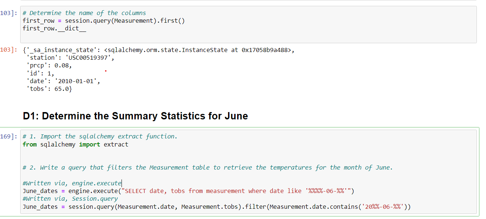
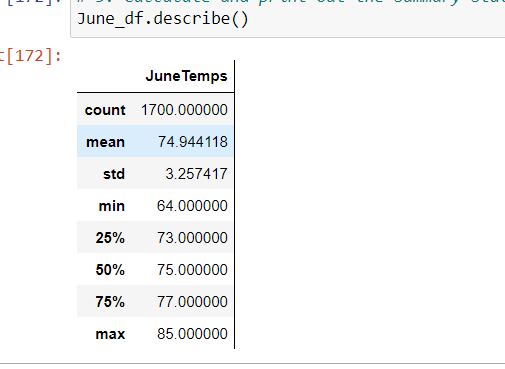
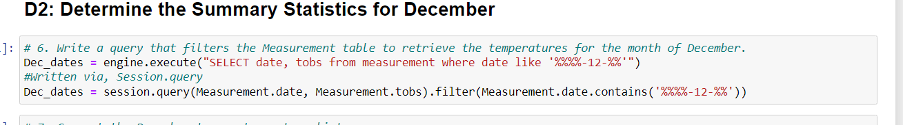
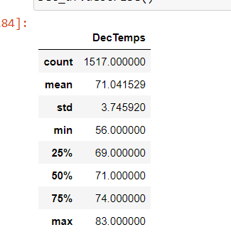

# Surfs-Up Analysis
## Overview
The purpose of this analysis was to create a breakdown of the weather in Oahu, Hawaii for our icecream and surf shop. We analyzed both precipation data and the tempurate data to identify the best months for business for our stakeholder.

## Results
* **June Temperatures**
    In our analysis we wrote code to find the data for the month of June from our Hawaii Database. This was done by using the code snapshot "June Dates" Seen below, and throught the df.describe method we can see some entry level statistics of our June data. 
    
    

    With a total record count of 1700, we can see that the max tempurate in June is 85, and the minimum temperature is 64, with the mean being around 74. On average, i would say it is warm in Oahu at this time.

    

* **December Temperatures**
    In our analysis we also wrote code to find the data for the month of December. By using the screenshot below, we were able to filter our Measurement table on december by passing in the "12" value as december.

    

    With a total record count of 1517, we can see that the max temperature in December is 83, and the minimum temperature is 56.  The mean is around 71 degrees. On average I would say that it is warm in Oahu at this time.

    

* **Key Differences**
    When comparing the two we notice a couple key differences, the first being that the number of recorded temperatures varies by around 150 records. With an additional 150 recorded temps, we could see our data in december change drastically. Another thing that we notice is the varince in the mean. June gave us a mean of around 74 and Dec gave us a mean of around 71. We can say with confidence that it is warmer in June then it is in December according to our dataset. The final thing that we notice is the difference of our standard deviation. December had a std dev of around 3.7 while June had a std dev of around 3.25 this means that the data of June stayed closer to the mean than the data of December did.

## Summary
In the months of June and December an icecream shop would be very sustainable in Oahu. Based off of temperature, when we look at these two months we see that the temperatures are very warm. With December receiving a low of 56 and June a low of 64. Both months provided a mean above 70 degrees which I would consider to be a warmer temperature. 

If i were to query for more weather information it would be about the precipitation information for the months of June and Months of December. To perform this, we will use the "June Code" as a baseline. By replacing the Measurement.tobs class with the prcp we can look at information related to precipation for June. 

The next query I would create would be station information for the two months to determine the specific areas that i should have my business in. By looking at Geolocation data we can find which areas recieve the warmest temperatures, as well as which areas recieve the highest amount of rainfall. To perform this we will need to combine our current Measurement tables with our Station tables on the station column. From there we would create a string similar to "December Code" 

With the code above, we would incorporate the class Station.latitude, and Station.longitude as well as Station.name in order to determine more information around the stations for these two months.